# Checkpoint — AI Biometric Campus Attendance & Event Access System

> **A dual-platform biometric attendance ecosystem combining an Enterprise Desktop Web Administration Portal, an Ultra-Fast Sub-Admin Mobile Scanning Terminal (Expo / React Native), and a GPU-accelerated ArcFace + FAISS Facial Recognition Microservice.**

---

## Executive Overview

Traditional campus event attendance relies on manual paper rosters, barcode scanners, or student ID tap cards—methods prone to proxy check-ins, long queues, barcode counterfeiting, and lost attendance sheets.

**Checkpoint** eliminates attendance fraud and gate bottlenecks through real-time facial biometrics. It features a distributed architecture with a clear separation of responsibilities:

1. **Desktop Web Administration Portal (React 19 + Vite + Tailwind CSS):** The centralized command center for full system governance. Administrators register students, enroll multi-angle 3D facial biometric templates, schedule campus events with strict attendance windows, provision sub-admin accounts, monitor live analytics, audit system access, and generate exportable reports (PDF, Excel, CSV).
2. **Sub-Admin Mobile Terminal (React Native + Expo Go):** A purpose-built, high-throughput scanning terminal for gate stewards and event coordinators. Sub-admins log in, see only their assigned events, and run high-FPS face scans with magnetic bounding box tracking, anti-spoofing liveness verification, and scheduled window enforcement.
3. **AI Biometric Inference Microservice (Python + Flask + ArcFace + FAISS):** Performs real-time face detection, 512-dimensional vector embedding extraction, anti-spoof liveness scoring, and sub-millisecond FAISS vector similarity search over direct local Wi-Fi.

---

## Dual-Platform System Architecture

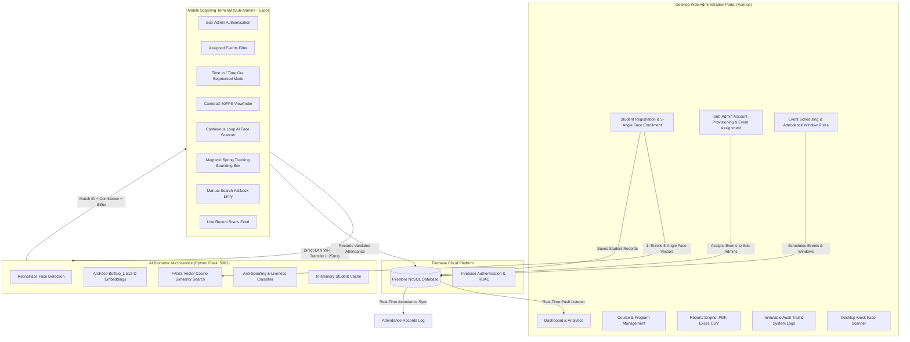

---

## Platform 1: Desktop Web Administration Portal

The desktop web portal gives school administrators complete governance over academic programs, student directories, biometric profiles, sub-admins, scheduled campus events, and compliance reports.

### 1. Unified Authentication Portal
A secure authentication gateway with role-based redirection for Super Admins and Sub-Admins, featuring a quick auto-fill credential toggle for rapid deployment and a public Student Attendance Lookup portal.

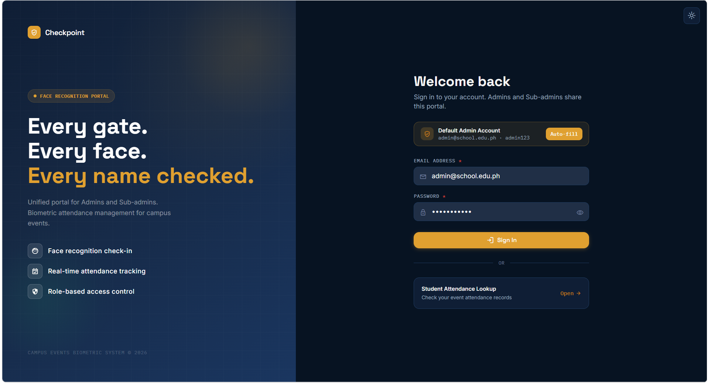

### 2. Executive Analytics & System Overview Dashboard
Real-time KPI metrics tracking Total Courses, Total Students, Enrolled Face Templates, Active Sub-Admins, Total Events, Today's Attendees, Late Check-ins, and System Recognition Accuracy (98.4%). Displays live event schedules and an audit trail of recent administrative actions.

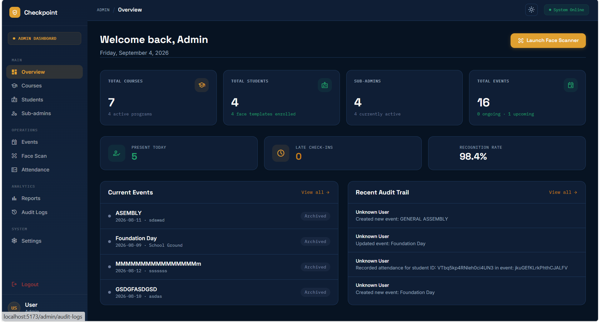

### 3. Academic Course & Program Management
Create, edit, and archive academic degree programs (e.g., BSIT, BSBA, BSA, BTLED). Automatically tracks enrolled student counts per department and enforces course-based event eligibility.

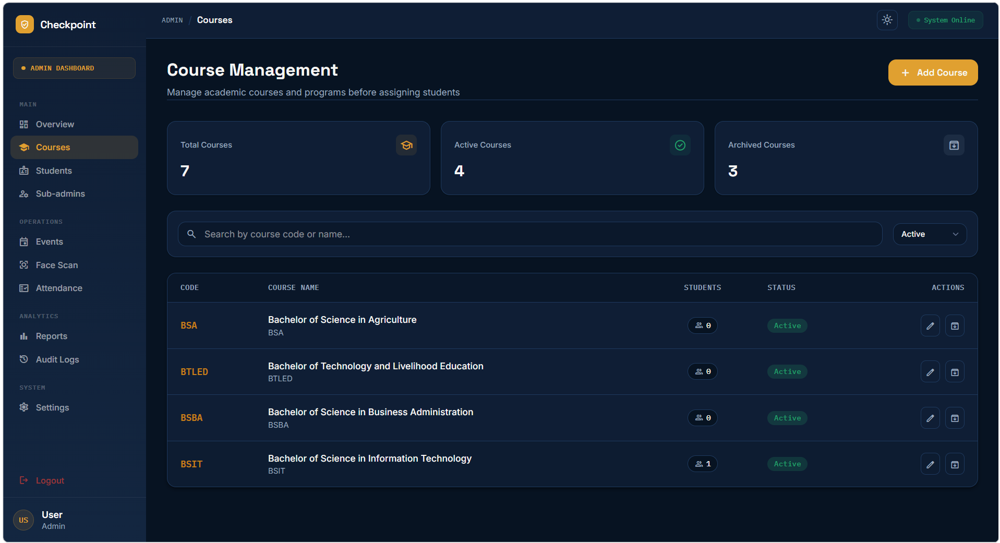

### 4. Student Directory & Biometric Profiles
Comprehensive student directory displaying student ID numbers, full names, degree programs, academic year levels, biometric enrollment status (`Face Enrolled` / `Pending`), and account status with instant search and filter controls.

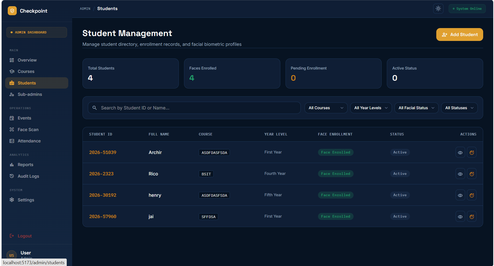

### 5. Multi-Angle Facial Biometric Enrollment
To achieve ultra-reliable matching across all lighting conditions and viewing angles, the enrollment modal guides students through a **5-Angle Biometric Capture sequence** (Frontal, Left Profile, Right Profile, Tilted Up, Tilted Down). Five distinct 512-D ArcFace vectors are generated and indexed into FAISS for maximum coverage.

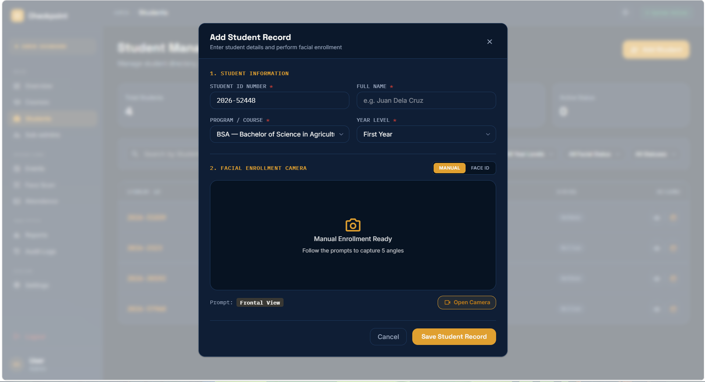

### 6. Sub-Admin Delegation & Role-Based Access Control (RBAC)
Administrators create and manage sub-admin assistant accounts (Event Coordinators, Student Council Officers, Gate Stewards), assign them specific system privileges, reset credentials, and assign them to scan specific event venues.

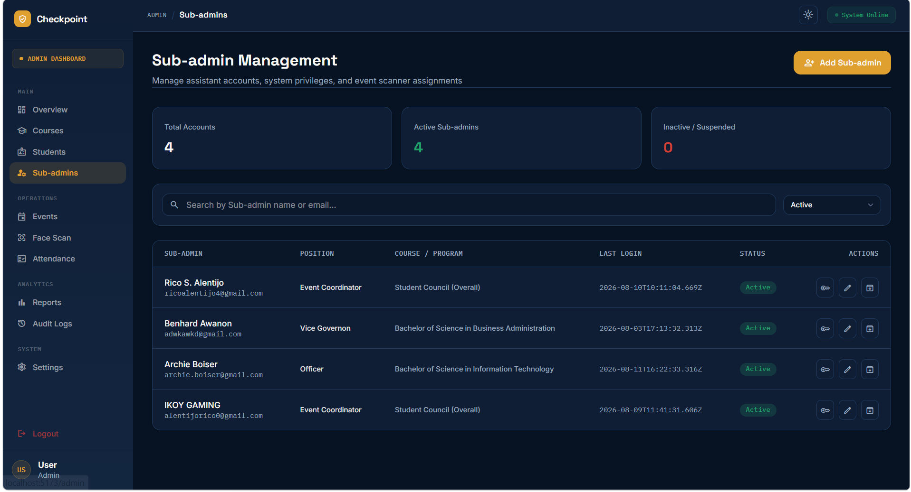

### 7. Event Scheduling & Attendance Window Rules
Create campus events with custom metadata: Event Title, Venue (e.g., DORSU Gym), Term, School Year, and Target Cohorts. Supports three attendance enforcement modes:
- **Time-In Only:** Single entry check-in.
- **Time-In & Time-Out:** Dual-verification requiring arrival and departure logging.
- **Time-Out Only:** Departure check-out.

Enforces automated start and cutoff windows to prevent unauthorized check-ins outside event hours, with automatic archiving upon event completion.

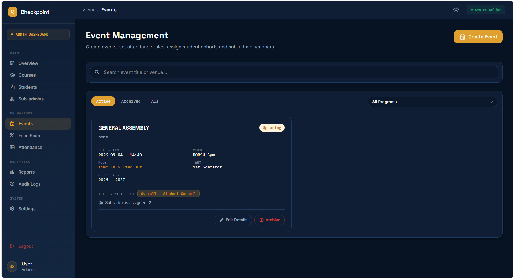

### 8. Desktop Kiosk Face Scanner
A built-in desktop scanning kiosk utilizing MediaPipe live facial landmark tracking combined with ArcFace server vector matching. Allows desktop stations to operate as high-volume entrance scanning booths.

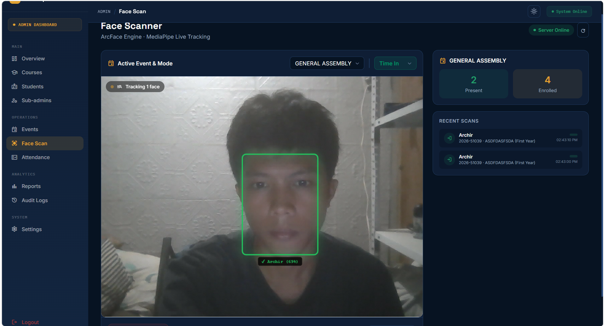

### 9. Master Attendance Audit Records Table
A unified live ledger of all campus attendance check-ins. Details attendee name, student ID, course/year level, event title, exact Time-In and Time-Out timestamps, status badge, verification method (`Facial Recognition` vs `Manual Backup`), and the operator who processed the scan.

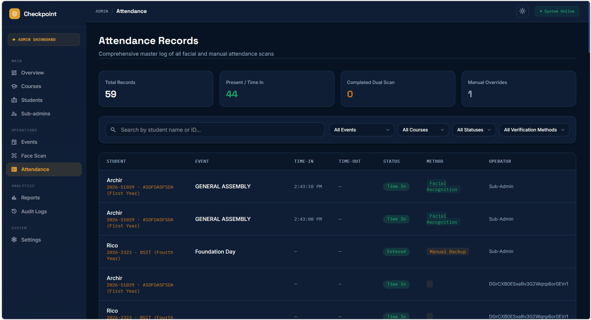

### 10. Filtered Attendance Reports & Multi-Format Export
Export filtered attendance rosters by Target Event, Course/Program, Year Level, and Attendance Status into presentation-ready **PDF Documents (.pdf)**, **Excel Spreadsheets (.xlsx)**, and **CSV Data Sheets (.csv)** for academic archiving and grade clearance.

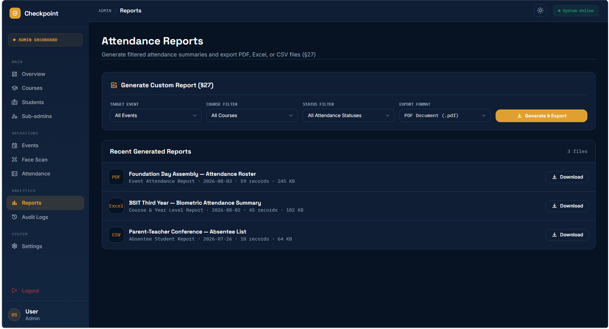

### 11. Immutable System Security Audit Logs
An immutable security audit log that records every action across the system: administrative logins, student registrations, biometric re-enrollments, event creations, attendance overrides, and scanner activities, complete with timestamp, operator role, action type, before/after values, and device IP.

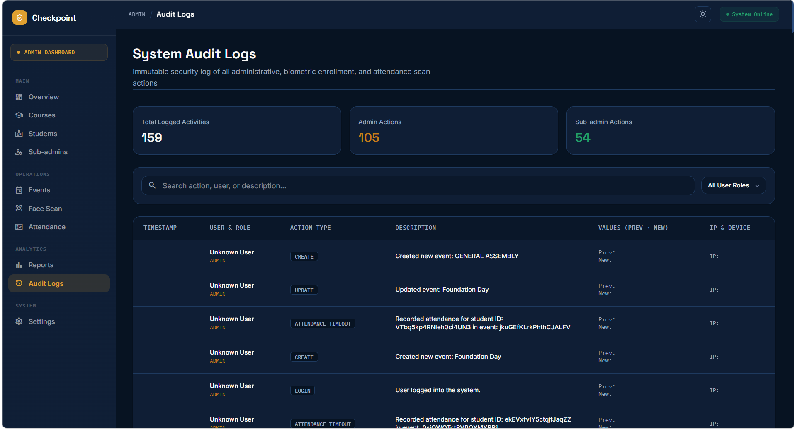

### 12. System & Biometric Configuration
Customization suite allowing administrators to adjust system branding, attendance grace periods, ArcFace similarity thresholds, anti-spoofing strictness, and administrator security credentials.

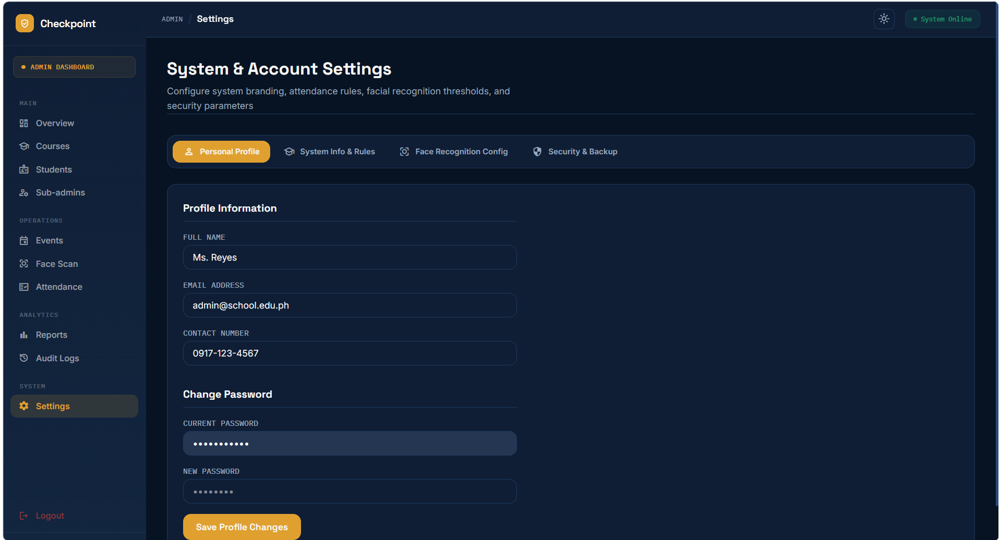

---

## Platform 2: Mobile Sub-Admin Gate Terminal (Expo / React Native)

The mobile terminal is designed specifically for **gate stewards and event sub-admins** whose sole operational role is taking attendance quickly, accurately, and securely at entrances and gym gates.

### 1. Instant Launch & Sub-Admin Authentication
Lightweight startup with sub-admin credential authentication. Restricts scanning privileges strictly to authorized gate stewards.

| Native Splash Screen | Sub-Admin Login Screen |
|:---:|:---:|
| 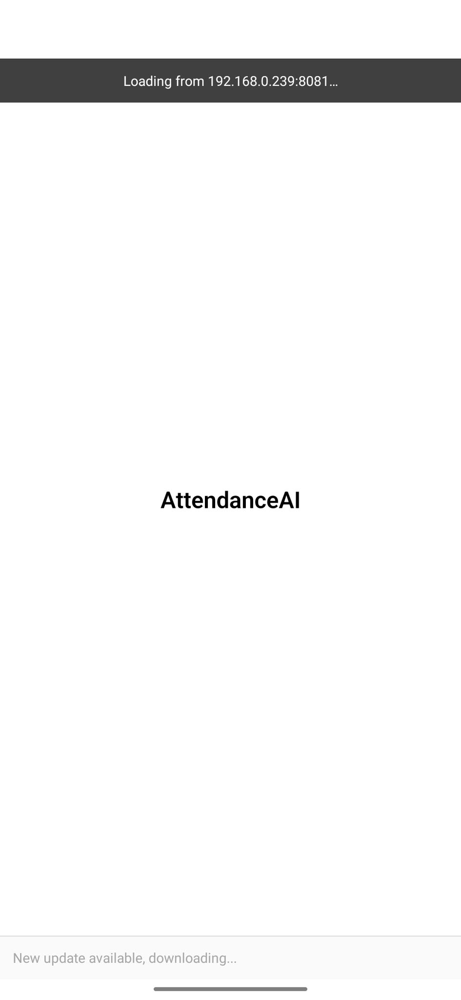 | 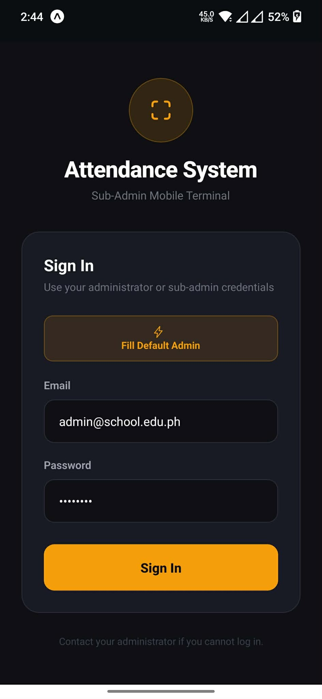 |

### 2. Zero-Config Local Network Discovery
Because campus Wi-Fi setups vary, the mobile terminal features a dedicated Server Setup screen. Sub-admins enter the host laptop's local IP (e.g., `192.168.0.239`) with built-in instant health-check verification, guaranteeing 0-latency direct LAN communication.

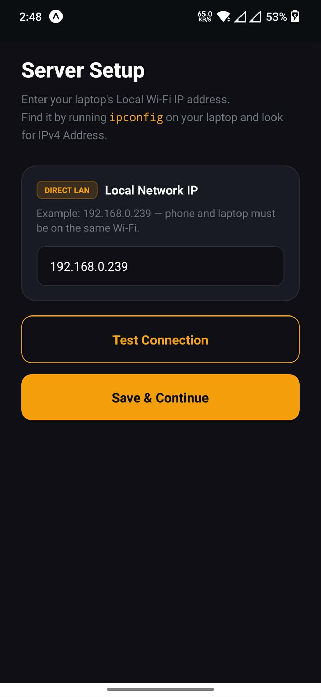

### 3. Assigned Events Hub & Window Enforcement
Sub-admins only see events specifically assigned to them by the administrator. Each event card displays venue, scheduled time, and real-time status (`Upcoming`, `In Progress`, `Closed`). The app automatically enforces time windows, locking the scanner if an event's attendance period has not opened or has expired.

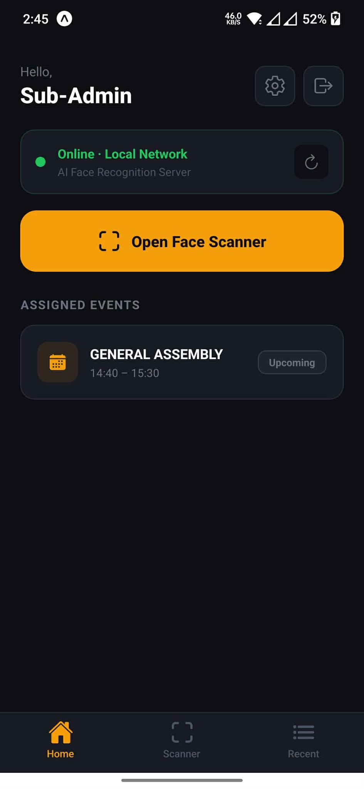

### 4. High-FPS Biometric Scanner with Magnetic Face Tracking
The core scanning interface features:
- **Aspect-Ratio FILL_CENTER Mapping:** Perfect coordinate translation matching Android CameraX viewport zooming and cropping, with automatic front/back camera mirroring.
- **Magnetic Bounding Box Tracking:** Powered by critically damped spring physics (`tension: 170, friction: 18`) and micro-jitter low-pass filtering. Even with quick head movements, the bounding box clings smoothly and organically to the face with zero wobble or rubber-banding.
- **Segmented Control:** One-tap switching between **[ Time In ]** and **[ Time Out ]** with lock indicators for closed windows.
- **Live Statistics Strip:** Instant counters for **PRESENT**, **TIME OUT**, and **TOTAL LOGS**.
- **Anti-Spoofing & Liveness Guard:** Filters out static photos and phone screen replays.
- **Multi-Frame Confirmation:** Prevents accidental scans from passersby by requiring consecutive positive frames before logging.

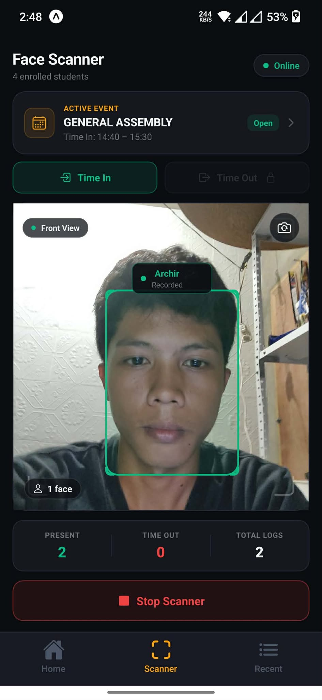

### 5. Live Recent Scans Feed
A real-time audit ledger accessible directly from the bottom navigation bar. Displays attendee names, student IDs, degree programs, exact timestamps, and operator signatures with color-coded status badges.

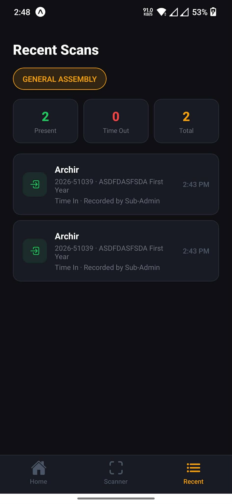

---

## AI & Biometric Pipeline Deep-Dive

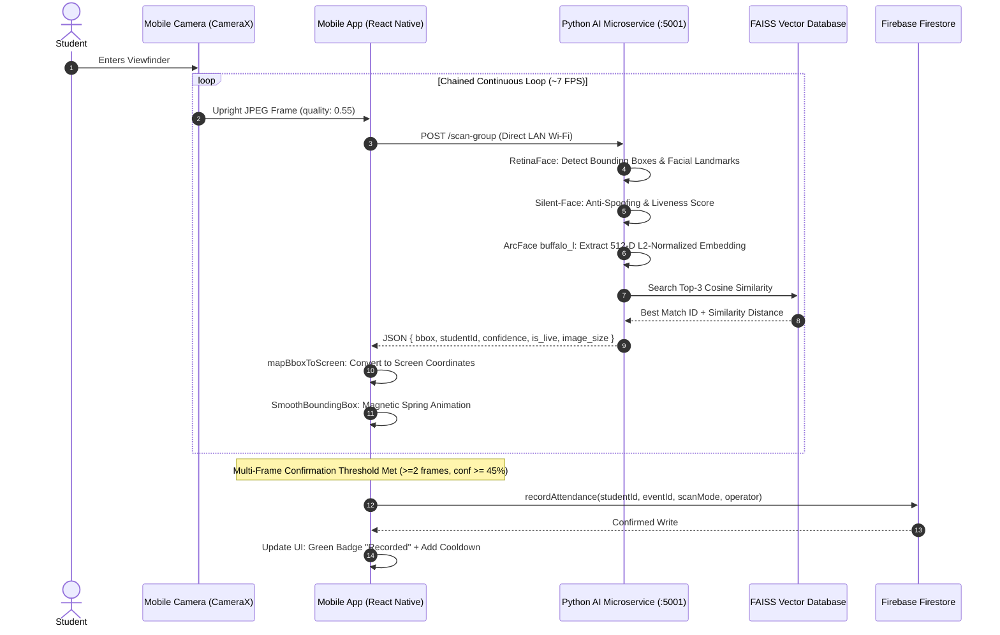

### Technical Innovations

1. **Chained High-FPS Scanning Loop:** Rather than using a rigid `setInterval`, the mobile terminal utilizes a self-triggering loop (`loopScan`) with a 35ms breather. Combined with optimized `0.55` quality JPEG encoding, loop cycle latency is reduced to ~130ms (~7 FPS), delivering real-time responsiveness.
2. **Critically Damped Spring Dynamics:** Replaces standard linear interpolations with React Native `Animated.spring` (`tension: 170, friction: 18`). Prevents overshoot oscillation and eliminates rubber-banding when students walk past the lens.
3. **Deadband Low-Pass Jitter Filter:** Filters out camera sensor noise under 2.5px when the student is stationary, keeping the bounding box rock-solid.
4. **Persistent Component Keys:** Uses strict `student_${id}` and `unknown_${idx}` React keys to prevent unmounting and remounting during confidence state transitions, ensuring continuous fluid animation.
5. **In-Memory Zero-Delay Student Caching:** The Python backend serves student metadata directly from an in-memory dictionary synchronized with FAISS, eliminating redundant database roundtrips during live scanning.

---

## Technology Stack

| Component | Technologies Used | Key Purpose |
|:---|:---|:---|
| **Desktop Web Admin** | React 19, Vite, Tailwind CSS, Lucide Icons, Headless UI | Central management dashboard, enrollment, reports, RBAC |
| **Mobile Scanner Terminal** | React Native 0.86, Expo 57, Expo Router, Expo Camera (CameraX), Reanimated | Portable gate scanning terminal for sub-admins |
| **Biometric AI Engine** | Python 3.10, InsightFace (ArcFace buffalo_l), RetinaFace, OpenCV, FAISS, Silent-Face | Face detection, 512-D vector embeddings, liveness detection |
| **Cloud Database & Auth** | Firebase Cloud Firestore, Firebase Auth, AsyncStorage | Real-time multi-device synchronization, security rules |
| **Reporting & Export** | jsPDF, SheetJS (XLSX), Papaparse | 1-click PDF roster, Excel summary, and CSV downloads |
| **Networking & Transport** | Direct LAN Wi-Fi (HTTP REST, AbortController, Timeout guards) | Sub-35ms frame delivery between phone and backend |

---

## Security, Privacy & Role-Based Access Control

- **Biometric Privacy:** Raw facial images are **never stored permanently** on disk. During enrollment, images are immediately converted into 512-dimensional numerical vectors (ArcFace embeddings) and discarded.
- **Anti-Spoofing Protection:** Silent Face Anti-Spoofing detects pixel disparity and texture artifacts, preventing printed photo or video replay bypasses.
- **Strict Time-Window Enforcement:** The system automatically locks scanning when attendance windows expire, preventing post-event fraudulent check-ins.
- **Role-Based Segmentation:**
  - **Super Admin:** Complete access to student management, course creation, event scheduling, sub-admin management, reports, and security audit logs.
  - **Sub-Admin:** Restricted strictly to assigned events, live face scanning, manual backup lookups, and the recent attendance feed.

---

## Project Structure

```
attendanceSystem/
├── client/                     # Desktop Web Administration Portal (React 19 + Vite)
│   ├── src/
│   │   ├── components/         # Modals, Navbar, Sidebar, StatCards, CameraModal
│   │   ├── pages/              # Overview, Students, Courses, Events, Scanner, Reports, Logs
│   │   ├── services/           # Firebase sync, ArcFace API integration, Export utils
│   │   └── App.jsx
│   └── package.json
│
├── mobile/                     # Sub-Admin Mobile Scanning Terminal (Expo / React Native)
│   ├── app/
│   │   ├── (auth)/login.tsx    # Sub-admin authentication
│   │   ├── (app)/
│   │   │   ├── home.tsx        # Assigned events hub & system status
│   │   │   ├── scanner.tsx     # High-FPS face scanner with magnetic tracking
│   │   │   └── recent.tsx      # Live recent scans feed
│   │   └── setup.tsx           # Direct LAN server IP discovery
│   ├── firebase/               # Mobile Firebase configuration & attendance subscriptions
│   └── package.json
│
├── server/                     # AI Facial Recognition Microservice (Python Flask)
│   ├── app.py                  # ArcFace, RetinaFace, FAISS search, liveness detection
│   ├── requirements.txt        # insightface, faiss-cpu, opencv-python, flask
│   └── models/                 # ArcFace buffalo_l & anti-spoofing model weights
│
├── screenshots/                # Application demonstration screenshots
│   ├── expo1.jpg - expo6.jpg   # Mobile terminal screenshots
│   └── web1.png - web12.png    # Desktop web portal screenshots
│
└── README.md                   # Project documentation
```

---

## Getting Started & Local Setup

### 1. Prerequisites
- **Node.js** v18 or later
- **Python** 3.9 or 3.10 with C++ Build Tools (for InsightFace & FAISS)
- **Expo Go** app installed on an Android or iOS device
- Both the laptop and phone connected to the **same local Wi-Fi network**

### 2. Start the AI Microservice
```powershell
cd server
python -m venv venv
venv\Scripts\activate
pip install -r requirements.txt
python app.py
```
*The server will start listening on port `5001` and load the ArcFace buffalo_l model and FAISS vector index.*

### 3. Start the Desktop Web Admin Portal
```powershell
cd client
npm install
npm run dev
```
*Access the Web Admin Portal at **`http://localhost:5173`**.*

### 4. Launch the Mobile Terminal
```powershell
cd mobile
npm install
npx expo start -c
```
1. Open **Expo Go** on your mobile device and scan the displayed QR code.
2. In the mobile app, navigate to **Server Setup** and enter your laptop's Wi-Fi IPv4 address (e.g. `192.168.0.239`).
3. Tap **Test Connection** to confirm connectivity, then log in with sub-admin credentials to start scanning!

---

## Author & Portfolio Contact

* **Developer:** Campus Biometric Attendance System Team
* **Project Status:** Production-Ready MVP
* **License:** MIT License — Open for academic and institutional deployment.
