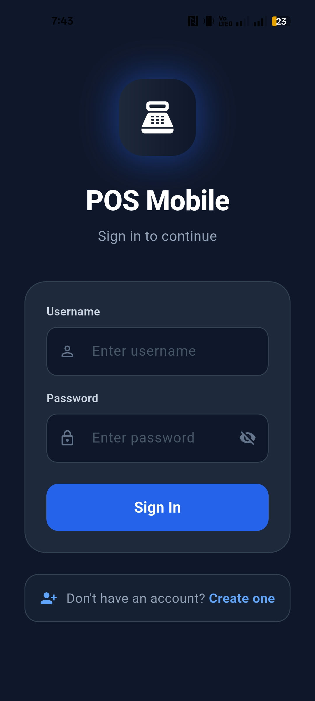
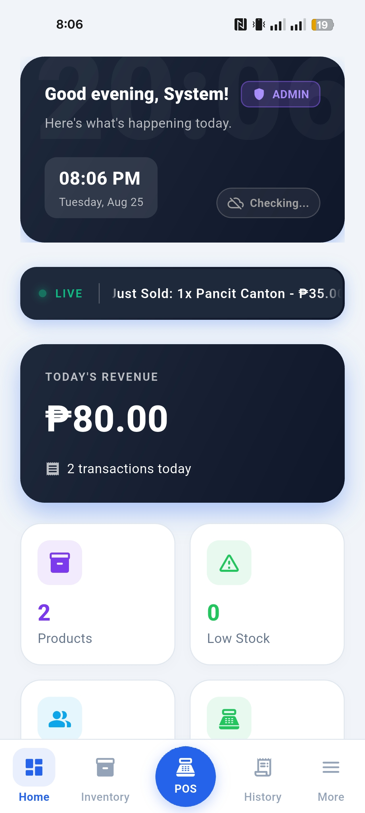
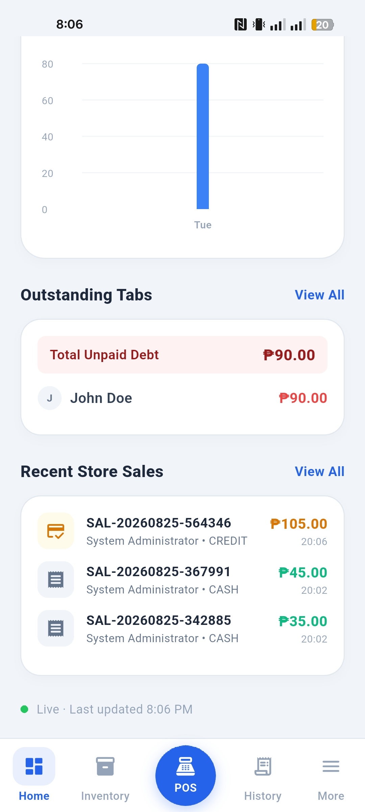
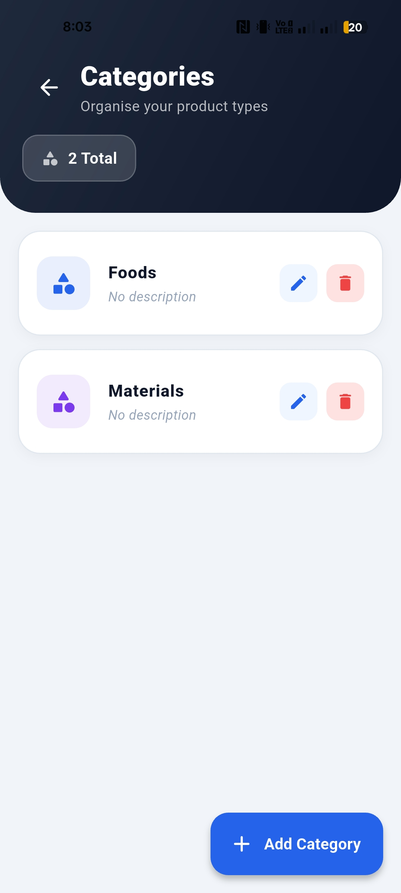
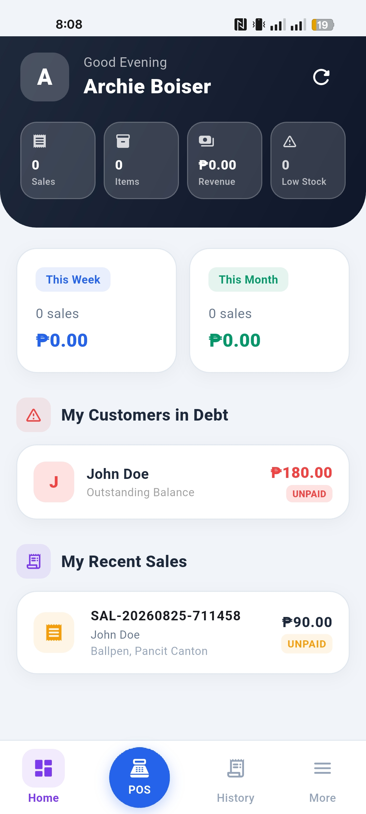
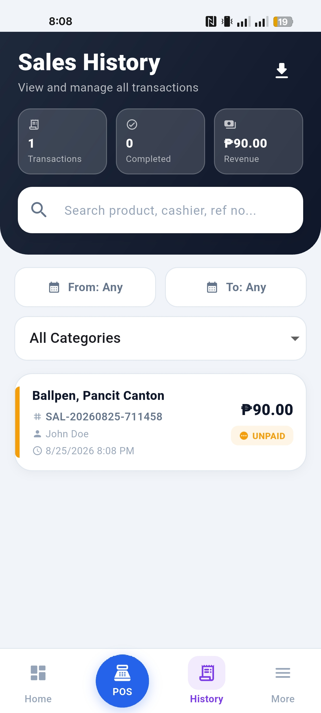
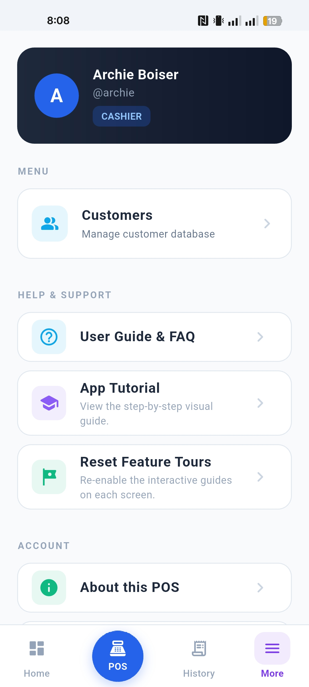
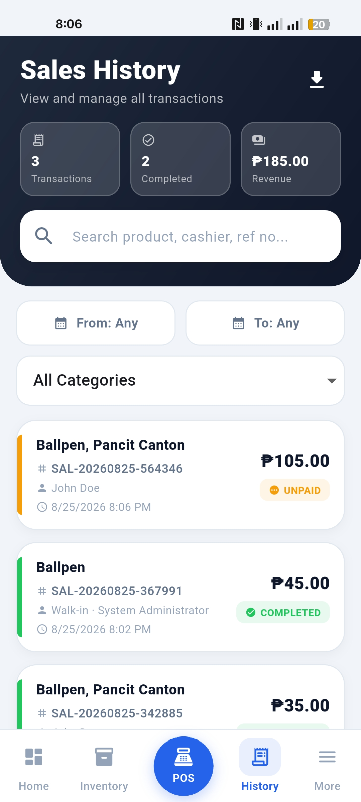
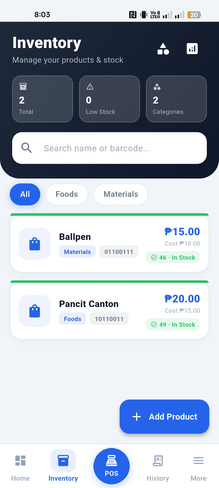

# ☁️ CloudZone POS — Multi-Device Point of Sale System

> A full-featured, cloud-synced Point of Sale mobile application built with **Flutter** and **Firebase**, designed for small to medium retail businesses. Supports multiple cashier devices in real-time with a centralized admin dashboard.

---

## 📱 Screenshots

| Login | Admin Dashboard | Admin Dashboard 2 |
|---|---|---|
|  |  |  |

| Checkout (Cash) | Checkout (Credit) | Receipt |
|---|---|---|
| .jpg) | .jpg) | .jpg) |

| Inventory | Customers | Users Management |
|---|---|---|
|  | .jpg) | .jpg) |

| Cashier Dashboard | Cashier POS | Cashier Sales History |
|---|---|---|
|  |  |  |

| Sales History | Expenses | POS Screen |
|---|---|---|
|  | .jpg) |  |

---

## 🚀 Overview

**CloudZone POS** is a production-ready Point of Sale system built for real-world retail operations. The system was designed from the ground up to handle a common pain point for small businesses: **multiple cashier devices that need to stay in sync without a dedicated server**.

The app solves this with a **dual-layer architecture** — a fast local SQLite database for instant offline performance, and Firebase Firestore as the real-time sync backbone. Any change made on any device (product added, sale completed, stock deducted) propagates to all other devices **within seconds**, automatically.

This is not a demo project — it was built, deployed, and tested in a real retail environment with actual cashiers and real transactions.

---

## ✨ Key Features

### 🏪 Point of Sale (POS)
- Product search by name or barcode scan
- Shopping cart with quantity control and inline editing
- **Dual discount modes** — percentage (%) or fixed peso amount (₱)
- **Searchable customer selector** — handles 50+ customers without scrolling pain
- Two payment modes: **Cash** (with change calculation) and **Credit** (debt tracking)
- Thermal-printable PDF receipt generation with sharing support
- Quick Actions shortcuts for fast product access

### 📊 Admin Dashboard
- Live KPI cards: Today's sales, revenue, total products, customers
- **7-day / 30-day revenue bar chart** with a toggle chip
- Live scrolling marquee of recent transactions
- Top debtors widget with real-time outstanding balances
- Recent debt payments grouped by individual transaction (not just by customer)
- One-click navigation to every section

### 📦 Inventory Management
- Full CRUD for products with category filtering
- Stock level badges: 🟢 In Stock / 🟡 Low Stock / 🔴 Out of Stock
- Low-stock threshold alerts configurable per product
- Category management with soft delete
- Inventory analytics and performance monitoring screen

### 👥 Customer & Debt Management
- Customer profiles with contact info
- Credit sales tracked per customer per transaction
- Debt payment recording with running balance per sale
- Payment history grouped by individual sale transaction
- **Debt isolation by cashier** — cashiers only see debts from their own sales; admin sees everything

### 📈 Sales History
- Full transaction log with unique reference numbers (e.g. `SAL-20260728-123456`)
- Filter by date range, category, and keyword search
- Tap any sale for a detailed bottom sheet receipt
- Void and return processing
- CSV export for external reporting

### 👤 User & Role Management
- **Admin** and **Cashier** roles with distinct permission sets
- Admin: full access — inventory, users, reports, expenses, factory reset
- Cashier: POS, sales history, customer management
- Password hashing with SHA-256 before storage — plaintext never touches the database
- User creation syncs to all devices instantly via Firestore

### 💸 Expenses Tracking
- Log business expenses with category and description
- Admin-only feature for financial oversight

### ☁️ Real-Time Cloud Sync
- **Firestore `snapshots()` listeners** on every device — no polling, no manual refresh needed
- Stock deducted on cashier's device → admin's Inventory updates within seconds, automatically
- New product added by admin → all cashier POS screens update without any action from the cashier
- New cashier account created → available on all devices immediately
- Works **offline** — all changes queue locally in SQLite and sync the moment connectivity returns

### 🔐 Security & Remote Control
- SHA-256 password hashing
- Role-based screen and feature access
- Session persistence across app restarts
- **Remote Factory Reset** — admin wipes all data on all connected devices simultaneously. Cashiers are automatically logged out the moment the reset signal reaches their device via Firestore, even if they are mid-session

### 🎓 Onboarding Tour
- Phase 1: Interactive tooltip tour highlights navigation tabs on first login
- Phase 2: Context-sensitive tooltips when visiting each screen for the first time
- Per-user tour state — each cashier gets their own independent first-run experience

---

## 🏗️ Architecture

```
┌───────────────────────────────────────────────────────┐
│                  Flutter App (Dart)                   │
│                                                       │
│   ┌──────────────┐          ┌──────────────┐          │
│   │   Admin UI   │          │  Cashier UI  │          │
│   │  Dashboard   │          │  POS Screen  │          │
│   │  Inventory   │          │  Dashboard   │          │
│   │  Users/Rpts  │          │  Sales Hist. │          │
│   └──────┬───────┘          └──────┬───────┘          │
│          │                         │                  │
│          └──────────┬──────────────┘                  │
│                     │                                 │
│              ┌──────▼──────┐                          │
│              │  DAO Layer  │  ProductDao, SaleDao,    │
│              │             │  CustomerDao, UserDao    │
│              └──────┬──────┘                          │
│                     │                                 │
│        ┌────────────▼────────────┐                    │
│        │      SyncEngine         │  (Singleton)       │
│        │  ┌──────────────────┐   │                    │
│        │  │  sync_queue      │   │  Write path        │
│        │  │  (SQLite)        │   │  Local → Firestore │
│        │  └──────────────────┘   │                    │
│        │  ┌──────────────────┐   │                    │
│        │  │ snapshots()      │   │  Read path         │
│        │  │ listeners        │   │  Firestore → Local │
│        │  └──────────────────┘   │                    │
│        │  • dataChanges stream   │                    │
│        │  • onForceLogout stream │                    │
│        └──────┬──────────┬───────┘                    │
│               │          │                            │
│        ┌──────▼──┐  ┌────▼───────────┐               │
│        │ SQLite  │  │   Firestore    │               │
│        │ (local) │  │  (real-time)   │               │
│        └─────────┘  └────────────────┘               │
└───────────────────────────────────────────────────────┘
```

### Data Flow
| Direction | Flow |
|---|---|
| **Write** | DAO → local SQLite → `sync_queue` → Firestore |
| **Real-time read** | Firestore `snapshots()` → local SQLite → `dataChanges` stream → screen rebuilds |
| **Offline write** | DAO → local SQLite → `sync_queue` (queued) → Firestore (when online) |

---

## 🛠️ Tech Stack

| Layer | Technology |
|---|---|
| **Framework** | Flutter 3 / Dart |
| **Local Database** | SQLite (`sqflite`) |
| **Cloud Database** | Firebase Firestore |
| **Authentication** | Firebase Auth |
| **State Management** | `setState` + Singleton Services + Dart Streams |
| **Real-time Sync** | Firestore `snapshots()` listeners |
| **PDF Generation** | `pdf` + `printing` |
| **Charts** | `fl_chart` |
| **Connectivity Detection** | `connectivity_plus` |
| **Cryptography** | SHA-256 via `crypto` package |
| **Onboarding Tooltips** | `showcaseview` |
| **Persistence** | `shared_preferences` |
| **File Sharing** | `share_plus` |

---

## 🔑 Technical Highlights

### 1. Real-Time Bidirectional Sync
The most technically challenging aspect of this project. Instead of simple periodic polling, I implemented **persistent Firestore `snapshots()` listeners** that fire instantly on document changes from any device. When a cashier completes a sale:

1. Local SQLite is updated instantly (zero-latency for the cashier)
2. The change is queued in `sync_queue` and drained to Firestore asynchronously
3. All other devices' listeners fire within seconds
4. Each listener upserts the change into local SQLite with FK enforcement disabled
5. A `dataChanges` broadcast stream notifies the active screen widget to rebuild without any `setState` boilerplate

### 2. FK-Safe Cross-Device Sync
A non-obvious challenge: SQLite uses auto-increment integer primary keys that differ across devices. The `products` table has `FOREIGN KEY (category_id) REFERENCES categories`, and `sales` references `user_id`. A naive `INSERT OR REPLACE` from Firestore data would silently throw FK constraint exceptions, meaning stock updates from cashiers would be **silently discarded** on the admin's device.

**Solution**: Disable FK enforcement (`PRAGMA foreign_keys = OFF`) during listener-driven inserts. For products specifically, use `UPDATE` (which has no FK lookup) for existing rows, guaranteeing stock deductions always propagate correctly.

### 3. Remote Factory Reset
Admin triggers a factory reset → a signal document is written to `Firestore → system/factory_reset`. All cashier devices already have a persistent listener on this document. When a new timestamp is detected:
- The device checks if it's a cashier (not admin) → proceeds
- Wipes all local SQLite tables atomically in a transaction
- Clears session preferences
- Fires `onForceLogout` stream → the UI immediately navigates to the Login screen

This works even for **offline cashier devices** — they are wiped the moment they reconnect.

### 4. Offline-First Design
Every write goes to local SQLite first. The `SyncEngine` maintains a `sync_queue` table. A drain function processes this queue in order, retrying on connectivity restore. This means:
- Cashiers can process sales with zero internet
- All data is preserved locally
- Sync catches up automatically and in-order

---

## 📐 Database Schema (Simplified)

```sql
users
  id, username, password (SHA-256), full_name, role, is_active

categories
  id, name, description, is_active

products
  id, name, category_id → categories, barcode, price,
  stock_quantity, low_stock_threshold, description, is_active

customers
  id, first_name, last_name, phone, email, address, is_active

sales
  id, reference_no (globally unique), user_id → users,
  customer_id → customers, total_amount, amount_paid,
  status (COMPLETED | UNPAID | VOIDED), created_at

sale_items
  id, sale_id → sales, product_id → products,
  product_name, quantity, unit_price

customer_payments
  id, customer_id → customers, sale_id → sales,
  amount_paid, paid_at

returns
  id, sale_id → sales, user_id → users,
  refund_amount, reason, return_date

expenses
  id, user_id → users, amount, category, description, created_at

sync_queue
  id, operation, collection, doc_id, payload, synced
```

---

## 🎯 What I Learned

- Designing **offline-first mobile apps** that degrade gracefully without internet
- Managing **cross-device data synchronization** without a traditional REST backend
- Solving **SQLite foreign key constraint** issues in multi-device environments
- Building **real-time UI updates** using Dart streams and Firestore snapshot listeners
- Implementing **role-based access control** at both the UI and data layers
- Generating and printing **PDF receipts** from a mobile device
- Handling **SQLite type coercion** (Firestore `bool` → SQLite `INTEGER`)
- Remote device management (factory reset, force logout) via Firestore signals
- Designing a **sync queue** with idempotent writes and proper ordering

---

## 📦 Setup (Development)

```bash
# Clone the repository
git clone <your-repo-url>
cd posapplication

# Install Flutter dependencies
flutter pub get

# Configure Firebase
# 1. Create a Firebase project at console.firebase.google.com
# 2. Enable Firestore and Authentication (Email/Password)
# 3. Download google-services.json → android/app/
# 4. Run: flutterfire configure

# Run in debug mode
flutter run

# Build release APK
flutter build apk
# Output: build/app/outputs/flutter-apk/app-release.apk
```

---

## 🙋 About the Developer

This project was built by **Chi** — a self-taught developer from the Philippines, passionate about solving real-world problems with mobile technology.

CloudZone POS was built for an actual small retail business, deployed and tested in production with real cashiers handling real transactions every day.

> *"I didn't just build a demo. I built something someone actually uses every day."*

---

*Built with Flutter · Firebase · SQLite · Made in the Philippines 🇵🇭*
